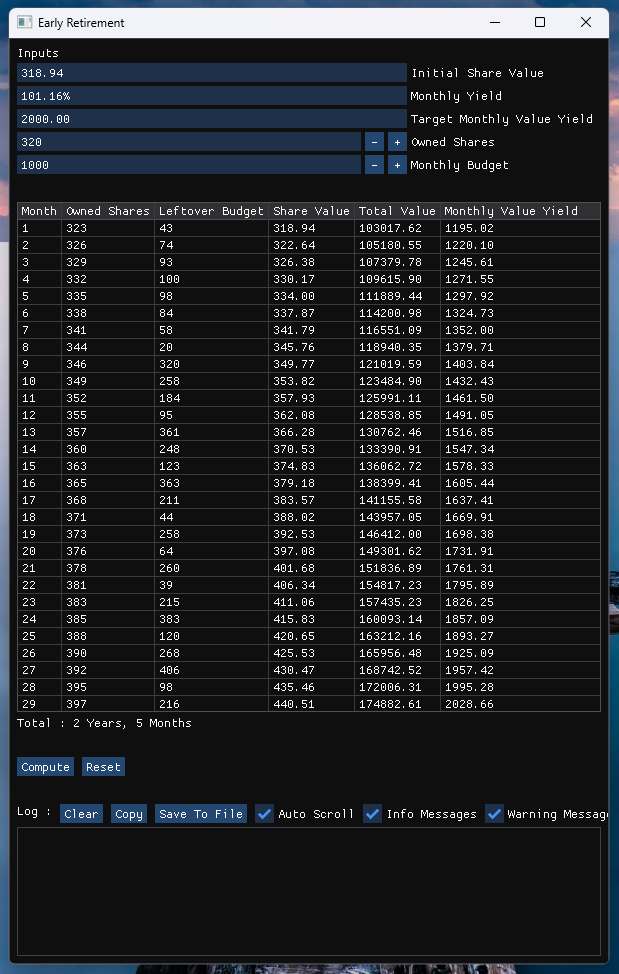

# Early Retirement - Compute The Date Of Your Early Retirement
**Early Retirement** is an investing tool that
computes how long it'd take to get yourself into
an early retirement by buying shares for a fixed
amount of money from a fund every month. Simply
provide it the current share value, the expected
monthly yield, your target monthly value yield
(how much money you'll need a month to sustain
your retirement), how much shares you currently
own and how much money you're willing to put into
your retirement a month and it'll return a table
of all investment data until you can retire.

Here's an example using **Vanguard VTI** as of
**August 28th, 2025**, requiring **$2000/month**,
initially owning **320** shares and putting
**$1000/month** into the retirement :
